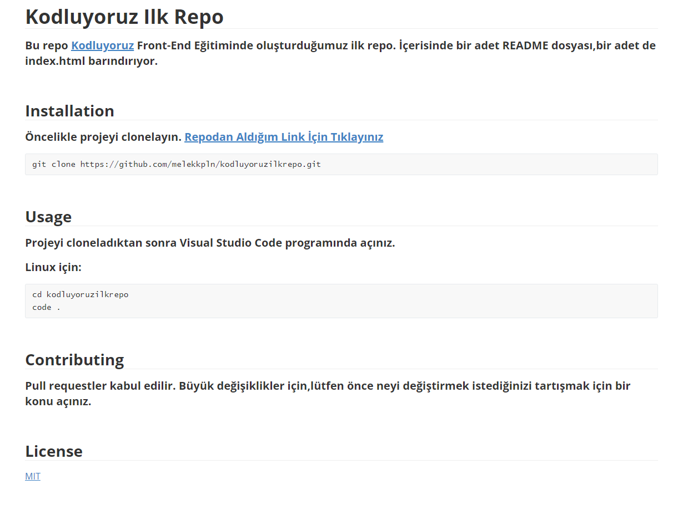

# Kodluyoruz Ilk Repo


#### Bu repo [Kodluyoruz](https://kodluyoruz.org) Front-End Eğitiminde oluşturduğumuz ilk repo. İçerisinde bir adet README dosyası,bir adet index.html ve bir adet images dosyası bulunduruyor.


## Installation


#### Öncelikle projeyi clonelayın. [Repodan Aldığım Link İçin Tıklayınız](https://github.com/melekkpln/kodluyoruzilkrepo.git)

```
git clone https://github.com/melekkpln/kodluyoruzilkrepo.git
```


## Usage 


#### Projeyi cloneladıktan sonra Visual Studio Code programında açınız.

#### Linux için:

```
cd kodluyoruzilkrepo
code .
```


## Contributing


#### Pull requestler kabul edilir. Büyük değişiklikler için,lütfen önce neyi değiştirmek istediğinizi tartışmak için bir konu açınız.


## License

[MIT]()

